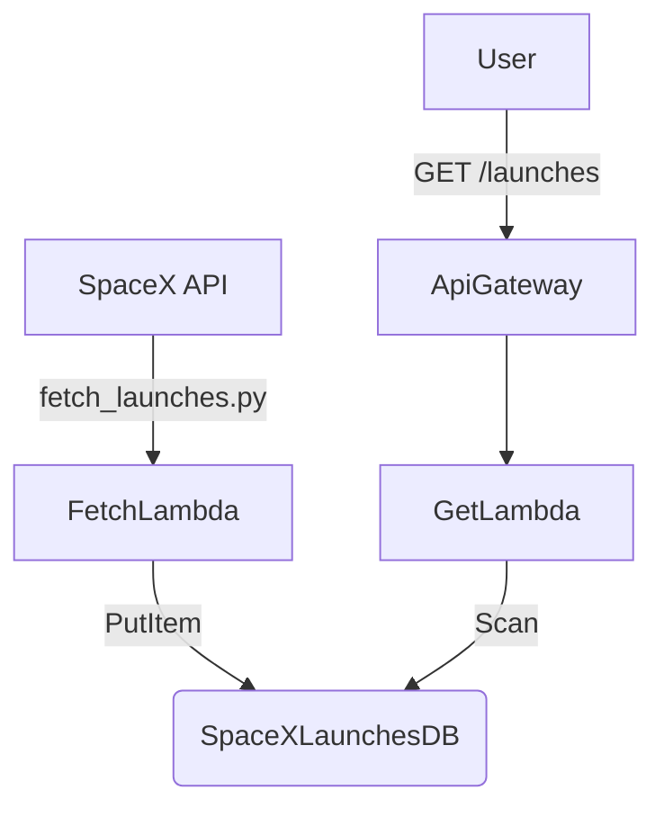

# 🚀 SpaceX Launch Tracker (Technical Challenge - efrouting)

Serverless backend for ingesting and exposing SpaceX launch data.  
Built with AWS Lambda, DynamoDB, API Gateway, and automated using SAM and GitHub Actions.

## 📁 Project Structure
```bash
SpacexBackend/               # Backend (Lambda functions + API Gateway + DynamoDB)
.
├── api-docs/
│   ├── swagger_template.yaml       # Template file (with placeholder for API URL)
│   ├── swagger_ui/
│   │   └── index.html              # Swagger UI HTML
│   └── upload_swagger.sh           # Upload script (replaces API URL + syncs to S3)
├── aws_lambda/
│   ├── fetch_launches/         # Lambda to fetch SpaceX launches and store in DynamoDB
│   └── get_launches/           # Lambda to expose latest launches via GET
├── tests/                      # Unit tests per lambda
├── .github/workflows/          # GitHub Actions CI/CD workflows
│   ├── deploy-backend.yml
│   └── test-backend.yml
├── template.yaml               # SAM infrastructure template
├── samconfig.toml              # SAM deployment config
├── requirements.txt            # Shared dependencies (if needed)
└── README.md
```
## 📘 API Documentation (Swagger / OpenAPI) 

This project includes an OpenAPI specification for the SpaceX Launches API.  
The Swagger UI is **automatically deployed to S3** every time `swagger_template.yaml` or `upload_swagger.sh` is modified on the `main` branch.

### 🧪 Preview Interactive API Docs
Once deployed, Swagger UI will be available at:
[swagger](https://spacex-swagger-ui-730335517851.s3.amazonaws.com/index.html)

👉 [Open Swagger Editor](https://editor.swagger.io)

## 🛠️ How to Deploy Infrastructure from Scratch

### 📌 Requirements

* AWS CLI configured (with credentials)
* AWS SAM CLI installed
* Python 3.10+

# 🚀 Initial setup

```bash
sam build
sam deploy --guided
```

**You’ll be prompted to set:**

* Stack name: spacex-backend
* Region: e.g., us-east-1
* IAM capabilities: CAPABILITY_IAM
* Save configuration: yes → will create samconfig.toml

## Next time:
```bash
sam deploy
```
## 🚀 Manual Deployment From Scratch

This project uses AWS SAM to provision the full backend infrastructure automatically.

### 📦 Requirements
- AWS CLI configured (`aws configure`)
- AWS SAM CLI installed (`sam --version`)
- Python 3.10 or higher

### 🛠️ Steps to deploy manually

1. Clone the repository:
```bash
git clone https://github.com/your-username/SpacexBackend.git
cd SpacexBackend
```
2. Build the SAM application: 
```bash
sam build
```

3. Deploy the stack for the first time:
```bash
sam deploy --guided
```
> You’ll be prompted to configure:
> Stack name → `spacex-backend`
> AWS region → `us-east-1`
> Capabilities → `CAPABILITY_IAM`
> Save config to samconfig.toml → `Yes`

4. On future deployments:
```bash
sam deploy
```

### 📄 Deploy Swagger UI Manually

The Swagger UI is hosted on an S3 bucket configured as a static website.

#### 📁 Folder structure
Make sure your folder `api-docs/swagger_ui/` contains:
- `index.html` → Swagger UI frontend
- `swagger.yaml` → Generated API definition (automatically injected from template)

#### 🛠️ Generate and upload Swagger files manually:

1. Make the upload script executable:
```bash
chmod +x api-docs/upload_swagger.sh
```
2. Run the script:
```bash
bash ./api-docs/upload_swagger.sh
```
This will:

* Inject the deployed API Gateway URL into your swagger_template.yaml.
* Generate swagger_ui/swagger.yaml.
* Upload the entire swagger_ui/ folder to the S3 bucket created by SAM.
> ⚠️ The bucket name is automatically derived as:
> `spacex-swagger-ui-<your-account-id>`

# 🧪 Running Tests Locally
Tests are isolated per lambda.

```bash
python -m venv venv
source venv/bin/activate
pip install -r requirements.txt
pytest --cov=aws_lambda tests/
```

# ⚙️ CI/CD Pipeline with GitHub Actions

## 🔁 Automated Triggers
* On push to main
* On pull request to main

## 🧪 test-backend.yml
* Installs dependencies
* Runs all unit tests
* Shows coverage report

## 🚀 deploy-backend.yml
* Runs tests
* Builds SAM application
* Deploys stack to AWS
* Exports API Gateway URL (SpaceXLaunchesApiEndpoint)

## 📘 upload-swagger.yml
* Watches for changes to `swagger_template.yaml` or `upload_swagger.sh`.
* Automatically rebuilds Swagger and syncs it to the S3 bucket.
* Uses outputs from the backend stack to inject the correct API URL.

AWS credentials and region are managed via GitHub Secrets and Environment Variables.

# 🔗 How Components Interact


* fetch_launches Lambda runs every 6 hours (cron schedule).
* get_launches Lambda exposes the last 10 launches via HTTP GET.
* All infrastructure is deployed via template.yaml.

# 📤 Output Exports
The backend exposes this output:
```yaml
Outputs:
  SpaceXLaunchesApiEndpoint:
    Description: "Base URL for the SpaceX Launches HTTP API"
    Value: !Sub "https://${ServerlessHttpApi}.execute-api.${AWS::Region}.amazonaws.com"
    Export:
      Name: SpaceXLaunchesApiEndpoint
```

This URL is consumed by the frontend through CI and injected into the build.

# ✨ Extending
This solution is scalable and professional:
* Add new Lambdas in aws_lambda/
* Add integration tests with mocks or live resources
* Add rollback handling in CI with sam deploy versions
* Integrate monitoring via CloudWatch

# 🧠 Summary
✅ Infrastructure as Code (SAM)

✅ Automated testing and deployment (CI/CD)

✅ Separation of logic per lambda

✅ Cloud-native, production-ready stack