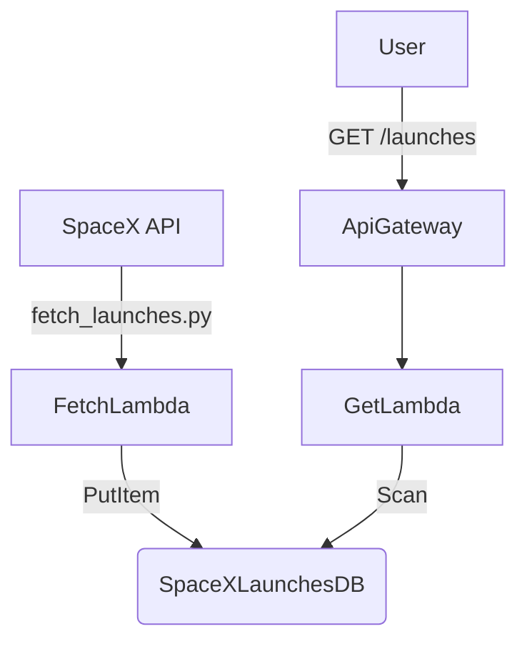

# 🚀 SpaceX Launch Tracker (Technical Challenge - efrouting)

Serverless backend for ingesting and exposing SpaceX launch data.  
Built with AWS Lambda, DynamoDB, API Gateway, and automated using SAM and GitHub Actions.

## 📁 Project Structure
```bash
SpacexBackend/               # Backend (Lambda functions + API Gateway + DynamoDB)
.
├── aws_lambda/
│   ├── fetch_launches/         # Lambda to fetch SpaceX launches and store in DynamoDB
│   └── get_launches/           # Lambda to expose latest launches via GET
├── tests/                      # Unit tests per lambda
├── .github/workflows/          # GitHub Actions CI/CD workflows
│   ├── deploy-backend.yml
│   └── test-backend.yml
├── template.yaml               # SAM infrastructure template
├── samconfig.toml              # SAM deployment config
├── requirements.txt            # Shared dependencies (if needed)
└── README.md
```

# 🛠️ How to Deploy Infrastructure from Scratch

# 📌 Requirements

* AWS CLI configured (with credentials)
* AWS SAM CLI installed
* Python 3.10+

# 🚀 Initial setup

```bash
sam build
sam deploy --guided
```

**You’ll be prompted to set:**

* Stack name: spacex-backend
* Region: e.g., us-east-1
* IAM capabilities: CAPABILITY_IAM
* Save configuration: yes → will create samconfig.toml

## Next time:
```bash
sam deploy
```

# 🧪 Running Tests Locally
Tests are isolated per lambda.

```bash
python -m venv venv
source venv/bin/activate
pip install -r requirements.txt
pytest --cov=aws_lambda tests/
```

# ⚙️ CI/CD Pipeline with GitHub Actions

## 🔁 Automated Triggers
* On push to main
* On pull request to main

## 🧪 test-backend.yml
* Installs dependencies
* Runs all unit tests
* Shows coverage report

## 🚀 deploy-backend.yml
* Runs tests
* Builds SAM application
* Deploys stack to AWS
* Exports API Gateway URL (SpaceXLaunchesApiEndpoint)

AWS credentials and region are managed via GitHub Secrets and Environment Variables.

# 🔗 How Components Interact


* fetch_launches Lambda runs every 6 hours (cron schedule).
* get_launches Lambda exposes the last 10 launches via HTTP GET.
* All infrastructure is deployed via template.yaml.

# 📤 Output Exports
The backend exposes this output:
```yaml
Outputs:
  SpaceXLaunchesApiEndpoint:
    Description: "Base URL for the SpaceX Launches HTTP API"
    Value: !Sub "https://${ServerlessHttpApi}.execute-api.${AWS::Region}.amazonaws.com"
    Export:
      Name: SpaceXLaunchesApiEndpoint
```

This URL is consumed by the frontend through CI and injected into the build.

# ✨ Extending
This solution is scalable and professional:
* Add new Lambdas in aws_lambda/
* Add integration tests with mocks or live resources
* Add rollback handling in CI with sam deploy versions
* Integrate monitoring via CloudWatch

# 🧠 Summary
✅ Infrastructure as Code (SAM)

✅ Automated testing and deployment (CI/CD)

✅ Separation of logic per lambda

✅ Cloud-native, production-ready stack